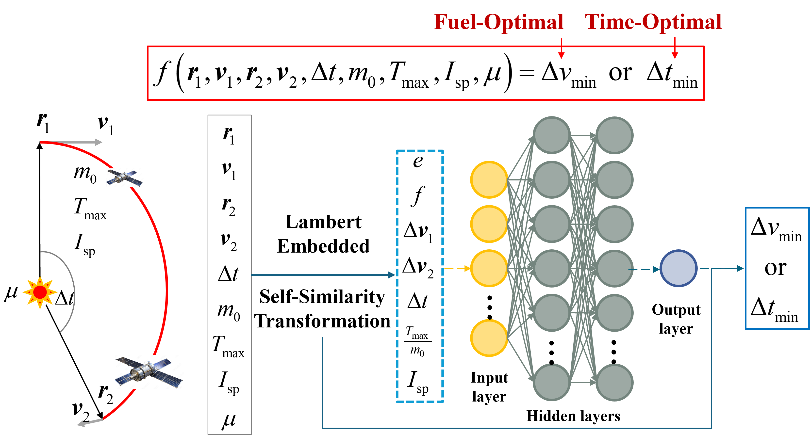

# Pretrained Approximators for Low-Thrust Trajectory Cost and Reachability

 
 


## Overview

This repository provides two neural‑network models that approximate optimal low‑thrust transfer solutions:

* **Δv Model** – Predicts the minimum total Δv for **fuel‑optimal** trajectories.
* **t<sub>min</sub> Model** – Predicts the minimum flight time for **time-optimal** trajectories and can be further utilized to assess trajectory reachability.

Both models are wrapped behind simple, language‑agnostic interfaces so they can be called from C++, Python, or MATLAB.

<p align="center">
  
</p>

*Figure 1 – I/O scheme of the prediction models.*

## Problem Statements

### 🚀 Fuel‑Optimal Transfer

```math
\begin{aligned}
\min_{\mathbf u}\quad
  & J_{\text{fuel}}
    =\int_{t_0}^{t_f}
      \frac{T_{\max}}{I_{\text sp}g_0}
      u\mathrm dt \\[2pt]
\text s.t.\quad
  & \dot{\boldsymbol x}= \boldsymbol D(\boldsymbol x)
    +\frac{T_{\max}}{m}\boldsymbol M(\boldsymbol x)\,\boldsymbol\alpha u,\\
  & \dot m =-\dfrac{T_{\max}u}{I_{\text sp}g_0},\\
  &  \boldsymbol x(t_0)=\boldsymbol x_0,\;m(t_0)=m_0,\\
  & \boldsymbol x(t_f)=\boldsymbol x_f.
\end{aligned}
```

### ⏱️ Time‑Optimal Transfer

```math
\begin{aligned}
\min_{\mathbf u,t_f}\quad
  & J_{\text{time}}
    =\int_{t_0}^{t_f}\!1\,\mathrm dt \\[2pt]
\text s.t.\quad
  & \dot{\boldsymbol x}= \boldsymbol D(\boldsymbol x)
    +\frac{T_{\max}}{m}\boldsymbol M(\boldsymbol x)\,\boldsymbol\alpha u,\\
  & \dot m =-\dfrac{T_{\max}u}{I_{\text sp}g_0},\\
  &  \boldsymbol x(t_0)=\boldsymbol x_0,\;m(t_0)=m_0,\\
  & \boldsymbol x(t_f)=\boldsymbol x_f(t_f).
\end{aligned}
```

## Valid Input Range

All inputs are non‑dimensionalised. The initial acceleration reference is calculated at 1 AU; nevertheless, the model is equally applicable to Earth‑centric transfers as long as the inputs fall inside the ranges below.

| Parameter | Range |
|-----------|-------|
| Semi‑major axis *a* (AU) | any |
| Eccentricity *e* | 0 – 1 |
| Inclination *i* (deg) | any |
| Normalised transfer time Δ*t* (n) | 0 – 0.99 |
| Initial acceleration *a*<sub>s,min</sub> (m s⁻²) | 2.5 × 10⁻⁶ [¹] |
| Initial acceleration *a*<sub>s,max</sub> (m s⁻²) | 1.2 × 10⁻² [¹] |
| Specific impulse *I*<sub>sp</sub> (s) | 700 – 9000 [¹] |

> [¹] Values evaluated at 1 AU.


## Citation

If you like this work, please cite:

```
Zhang, Z., Acciarini, G., Izzo, D., Baoyin, H., & Topputo, F. (2026). Pretrained Approximators for Low-Thrust Trajectory Cost and Reachability. To appear in Journal of Guidance, Control and Dynamics
```

If you have any questions, please contact:
**Zhong Zhang**  
Email: <zhongzhang.astro@gmail.com>


## Language Support


## Features

| Interface        | Binding / Library     | Status |
|------------------|-----------------------|:------:|
| **C++ (libtorch)**   | Libtorch C++ API        | ✔️     |
| **C++ (Eigen)**      | Eigen 3 (header-only)   | ✔️     |
| **Python (PyTorch)** | PyTorch      | ✔️     |
| **Python (Pybind)**  | Eigen via Pybind11 wrapper  | ✔️     |
| **MATLAB (MEX)**     | Eigen via MEX wrapper   | ✔️     |


### C++ Implementation

We provide two header-only C++ implementations:

| Implementation | Dependencies                          | Description                                                                                                                                              |
| -------------- | ------------------------------------- | -------------------------------------------------------------------------------------------------------------------------------------------------------- |
| **libtorch**   | Libtorch C++ API                      | Maximum flexibility but higher memory overhead, especially noticeable during extensive serial evaluations.                                                |
| **Eigen**      | Eigen 3 (embedded within source code) | Lightweight and optimized for speed; achieves more than 10× faster performance in serial evaluations due to minimal overhead and built-in SIMD optimizations. |

Both implementations are CPU-only by default. Advanced users may optionally integrate multi-threading, GPU acceleration, or Intel MKL optimization according to their specific needs.

#### Installation

As header-only interfaces, simply include the provided source code and model files directly into your project.

For usage examples, refer to the **Quick Start** guide.

---

### Python Implementation

We offer two Python implementations corresponding to the C++ versions:

| Implementation                                 | Dependencies          | Description                                                                                             |
| ---------------------------------------------- | --------------------- | ------------------------------------------------------------------------------------------------------- |
| **Pure Python Version (Based on libtorch)**    | PyTorch               | Translated from libtorch source code; supports batch processing for flexibility and easy integration.  |
| **High-Performance Version (Eigen via Pybind)** | Eigen, Pybind         | Optimized performance through Pybind wrapping; suitable for high-performance applications; available as a compiled extension on PyPI. |

#### Installation

| Implementation                                 | Installation Method                                  |
| ---------------------------------------------- | ---------------------------------------------------- |
| **Pure Python Version (Based on libtorch)**    | Directly copy provided source code and model files. |
| **High-Performance Version (Eigen via Pybind)** | Install from PyPI using: `pip install neural_lowthrust` |

For usage examples, refer to the **Quick Start** guide.


### Matlab

The MATLAB support is implemented via MATLAB’s built-in MEX interface, which compiles the C++/Eigen code into MATLAB-callable libraries.
  
**Installation**  
1. Download the `src/matlab` and `src/cpp/eigen_version` directories.  
2. Open MATLAB and navigate to the `src/matlab` folder.  
3. Run the `build_mex.m` script.  
4. Upon success, you should see three generated MEX library files.  
5. To use the interface, place those three library files in the same directory as your MATLAB `.m` script.  
 
For usage examples, refer to the **Quick Start** guide.

## Repository Layout

```markdown
.
├── models/                      # Pre-trained model files
│   ├── eigen_model_large        # Eigen-based Δv model
│   ├── eigen_model_tmin_large   # Eigen-based tₘᵢₙ model
│   ├── libtorch_model_dv        # libtorch-based Δv model
│   └── libtorch_model_tmin      # libtorch-based tₘᵢₙ model
│
├── src/                         # Source code
│   ├── cpp/
│   │   ├── eigen_version        # C++ implementation using Eigen
│   │   └── libtorch_version     # C++ implementation using libtorch
│   │
│   ├── python/
│   │   └── pytorch_version      # Python implementation using PyTorch
│   │
│   └── matlab/                  # MATLAB MEX implementation (Eigen)
│
├── tests_example/               # Example test scripts
│   ├── cpp_eigen_test.cpp       # C++/Eigen test
│   ├── cpp_libtorch_test.cpp    # C++/libtorch test
│   ├── python_pybind_test.py    # Python/Pybind test
│   ├── python_pytorch_test.py   # Python/PyTorch test
│   └── matlab_test.m            # MATLAB test
│
└── README.md                    
```


## Quick Start Examples

### C++/Eigen Implementation
```cpp
#include <iostream>
#include <vector>
#include "eigen_nn.h"

int main() {
    double rv0[6] = { 153200115041.471252, -371861548991.5148, -2457827991.59575,
                      16946.19084502839,    7728.20307500515,     384.482421963171 };
    double rvt[6] = { 388897087868.8704,   -26556461186.8488,   -6811565802.34408,
                      1823.09390143006,    18678.1151338133,    -865.324990277810 };
    double dt   = 23112000.0;   // s
    double m0   = 2500.0;       // kg
    double Tmax = 0.3;          // N
    double Isp  = 3000.0;       // s
    double mu   = 1.32712440018e20;
    double g0   = 9.80665;

    std::vector<double> input = {
        rv0[0],rv0[1],rv0[2],rv0[3],rv0[4],rv0[5],
        rvt[0],rvt[1],rvt[2],rvt[3],rvt[4],rvt[5],
        dt,m0,Tmax,Isp,mu
    };

    // Δv predictor
    EigenFastPredictor* predictor = new EigenFastPredictor("../src/eigen_nn_lowthrust/eigen_model_large");
    std::vector<double> mapped_dv = nn_input_1_rotate_lambert(input);
    double dv = predictor->fast_predict_vector(mapped_dv);
    std::cout << "Optimal control Δv  ≈ 2019.66 m/s;  Eigen predicts " << dv << " m/s\n";
    delete predictor;

    // Tmin predictor
    EigenFastPredictor* predictor_tmin = new EigenFastPredictor("../src/eigen_nn_lowthrust/eigen_model_tmin_large");
    std::vector<double> mapped_tmin = nn_input_1_rotate_lambert(input);
    double tf = predictor_tmin->fast_predict_vector_tmin(mapped_tmin);
    std::cout << "Optimal control t_f ≈ 2.0781e+07 s; Eigen predicts " << tf << " s\n";
    delete predictor_tmin;

    return 0;
}
```

### C++/Libtorch Implementation

```cpp
#include <torch/torch.h>
#include <iostream>
#include <vector>
#include "libtorch_nn.h"

int main() {
    double rv0[6] = { 153200115041.471252, -371861548991.5148, -2457827991.59575,
                      16946.19084502839,    7728.20307500515,     384.482421963171 };
    double rvt[6] = { 388897087868.8704,   -26556461186.8488,   -6811565802.34408,
                      1823.09390143006,    18678.1151338133,    -865.324990277810 };
    double dt   = 23112000.0;   // s
    double m0   = 2500.0;       // kg
    double Tmax = 0.3;          // N
    double Isp  = 3000.0;       // s
    double mu   = 1.32712440018e20;
    double g0   = 9.80665;

    std::vector<double> input = {
        rv0[0],rv0[1],rv0[2],rv0[3],rv0[4],rv0[5],
        rvt[0],rvt[1],rvt[2],rvt[3],rvt[4],rvt[5],
        dt,m0,Tmax,Isp,mu
    };

    // Δv model
    {
        std::string model_path = "../src/libtorch_nn_lowthrust/libtorch_model_dv";
        torch::Tensor Xmean, Xscale, Ymean, Yscale;
        torch::jit::script::Module net;
        libtorch_model_read(model_path, Xmean, Xscale, Ymean, Yscale, net);
        auto dv = fast_predict_vector_raw_data(input, Xmean, Xscale, Ymean, Yscale, net, 1);
        std::cout << "Optimal control Δv  ≈ 2019.66 m/s;  libtorch predicts " << dv << " m/s\n";
    }

    // Tmin model
    {
        std::string model_path = "../src/libtorch_nn_lowthrust/libtorch_model_tmin";
        torch::Tensor Xmean, Xscale, Ymean, Yscale;
        torch::jit::script::Module net;
        libtorch_model_read(model_path, Xmean, Xscale, Ymean, Yscale, net);
        auto tf = fast_predict_vector_raw_data(input, Xmean, Xscale, Ymean, Yscale, net, 2);
        std::cout << "Optimal control t_f ≈ 2.0781e+07 s; libtorch predicts " << tf << " s\n";
    }

    return 0;
}
```


### Python/Pytorch Implementation
```python
from pathlib import Path
from ptorch_nn_lowthrust import fast_predict_vector_raw_data, ptorch_model_read
if __name__ == "__main__":

    # ---------------- input ---------------------------------------------------
    rv0 = [
        153200115041.471252441406250,
        -371861548991.514770507812500,
        -2457827991.595745086669922,
        16946.190845028388139,
        7728.203075005149913,
        384.482421963170736,
    ]
    rvt = [
        388897087868.870422363281250,
        -26556461186.848796844482422,
        -6811565802.344083786010742,
        1823.093901430057258,
        18678.115133813287684,
        -865.324990277810116,
    ]
    dt = 23112000.0
    m0 = 2500.0
    Tmax = 0.3
    Isp = 3000.0
    mu = 1.32712440018e20

    input_vec = rv0 + rvt + [dt, m0, Tmax, Isp, mu]

    # ---------------- 1. Δv prediction -------------------------------------------------
    dv_model_dir = Path("../src/libtorch_nn_lowthrust/libtorch_model_dv")
    X_mean, X_scale, Y_mean, Y_scale, module = ptorch_model_read(dv_model_dir)

    pred_v = fast_predict_vector_raw_data(
        [input_vec], X_mean, X_scale, Y_mean, Y_scale, module, mode=1
    )[0]
    print(
        f"Optimal Control result (Reference): 2019.66 m/s, "
        f"Libtorch predicted (Python): {pred_v:.3f} m/s"
    )

    # ---------------- 2. tmin prediction --------------------------------------------
    tmin_model_dir = Path("../src/libtorch_nn_lowthrust/libtorch_model_tmin")
    X_mean, X_scale, Y_mean, Y_scale, module = ptorch_model_read(tmin_model_dir)
    pred_t = fast_predict_vector_raw_data(
        [input_vec], X_mean, X_scale, Y_mean, Y_scale, module, mode=2
    )[0]
    print(
        f"Optimal Control result (Reference): 2.0781e+07 s, "
        f"Libtorch predicted (Python): {pred_t:.3f} s"
    )

```

### Python/Pybind Implementation
```python
# Example script that calls the C++/Eigen predictor through pybind11
from neural_lowthrust import nn_lowthrust as lt
import numpy as np
from importlib.metadata import distribution

if __name__ == "__main__":

    # ─────────────────────────────────────────────────────
    # Initial and target state vectors
    rv0 = np.array([153200115041.47125, -371861548991.51477,
                    -2457827991.595745, 16946.19084502839,
                    7728.20307500515, 384.4824219631707])
    rvt = np.array([388897087868.8704, -26556461186.848797,
                    -6811565802.344083, 1823.093901430057,
                    18678.115133813287, -865.3249902778101])

    raw = list(rv0) + list(rvt) + [
           23112000.0,   # dt (s)
           2500.0,         # initial mass (kg)
           0.3,            # Tmax (N)
           3000.0,         # Isp (s)
           1.32712440018e20  # mu (m³/s²)
    ]

    # delta-v
    model_dir = str(distribution("neural_lowthrust").locate_file("neural_lowthrust/models/eigen_model_large"))
    pred = lt.EigenFastPredictor(model_dir)
    dv = pred.fast_predict_vector(lt.nn_input_1_rotate_lambert(raw))
    # tmin
    tmin_dir = str(distribution("neural_lowthrust").locate_file("neural_lowthrust/models/eigen_model_tmin_large"))
    pred_t = lt.EigenFastPredictor(tmin_dir)
    tmin = pred_t.fast_predict_vector_tmin(lt.nn_input_1_rotate_lambert(raw))

    print(f"Predicted delta-v: {dv:.2f} m/s")
    print(f"Predicted tmin:   {tmin:.2f} s")
```
### Matlab
```matlab
% test_nn_lowthrust.m
clc
clear all
close all

%% input
rv0 = [153200115041.47125; -371861548991.51477; -2457827991.595745;
       16946.19084502839;    7728.20307500515;  384.4824219631707];
rvt = [388897087868.8704;  -26556461186.848797;  -6811565802.344083;
       1823.093901430057;  18678.115133813287;  -865.3249902778101];
dt   = 23112000.0;
m0   = 2500.0;
Tmax = 0.3;
Isp  = 3000.0;
mu   = 1.32712440018e20;

inputVec = [rv0; rvt; dt; m0; Tmax; Isp; mu];

%% 2. process
processed = nn_input_1_rotate_lambert(inputVec);

%% 3. delta-v 
modelDirDV = fullfile(pwd, '../models', 'eigen_model_large');
dv = fast_predict_vector(modelDirDV, inputVec);
fprintf('Optimal Control result: 2019.66 m/s, EIGEN predicted first result: %.2f m/s\n', dv);

%% 4. tmin 
modelDirTmin = fullfile(pwd, '../models', 'eigen_model_tmin_large');
tmin = fast_predict_vector_tmin(modelDirTmin, inputVec);
fprintf('Optimal Control result: 2.0781e+07 s, EIGEN predicted first result: %.2f s\n', tmin);

```

## License
This project is licensed under the [MPL 2.0](https://www.mozilla.org/en-US/MPL/2.0/).
